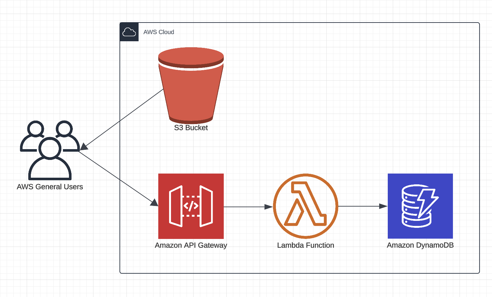

# Serverless Letter Verification System

## Overview
This serverless architecture implements a secure and scalable letter verification service integrated with the Udacity platform. The system leverages AWS cloud services to process user submissions, manage API access, and store verification results while maintaining security best practices.

## Architecture Components

### Frontend Integration
- An HTML interface hosted on Amazon S3
- Provides a user-friendly submission interface that communicates with the backend via REST API

### Core Processing Pipeline
1. **API Gateway (REST API)**
   - Exposes a secure POST endpoint for letter submissions
   - Manages request routing and API access control
   - Provides a standardized interface between the frontend and backend services

2. **Lambda Function (Letter Verifier)**
   - Implements the core verification logic
   - Enforces user rate limiting and quota management
   - Securely interfaces with OpenAI's API
   - Processes verification results and manages response handling

3. **DynamoDB (Data Persistence)**
   - Tracks user submission history and quota usage
   - Stores verification results and OpenAI responses
   - Enables efficient query patterns for user activity monitoring

## Key Benefits

### Security
- Protects sensitive API credentials through secure backend implementation
- Isolates OpenAI API access from client-side code
- Implements robust user quota management

### Scalability
- Serverless architecture automatically scales with demand
- Pay-per-use pricing model optimizes operational costs
- No infrastructure management overhead

## Technical Considerations
The architecture prioritizes security and performance while maintaining cost efficiency. By leveraging AWS managed services, we eliminate the need for server maintenance while ensuring high availability and reliable performance.

## Service Flow
1. Users interact with the HTML interface hosted in S3 and embedded in the Udacity platform
2. User submissions are sent to API Gateway's POST endpoint
3. API Gateway triggers the Lambda function
4. Lambda function:
   - Checks user's daily request limits in DynamoDB
   - If within limits, processes the request through OpenAI
   - Stores results in DynamoDB
   - Returns response to user
5. Results are displayed to the user through the interface

## Data Management
- User submission data is stored securely in DynamoDB
- Daily limits are tracked and enforced per user
- Historical verification results are maintained for audit purposes
